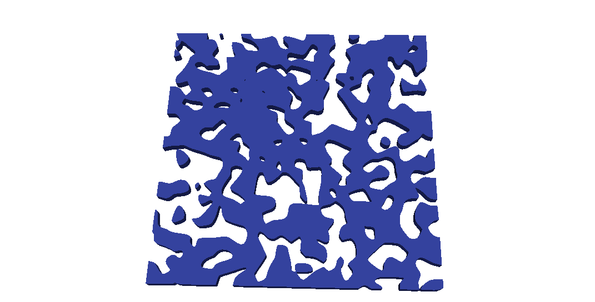
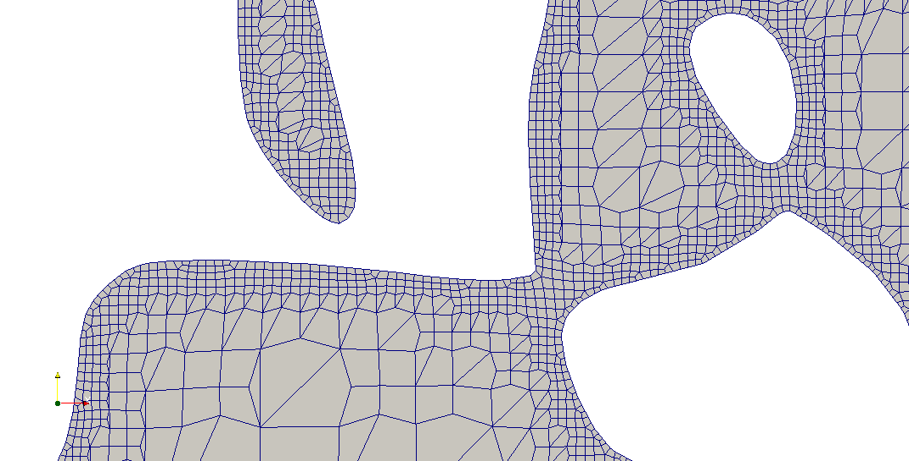
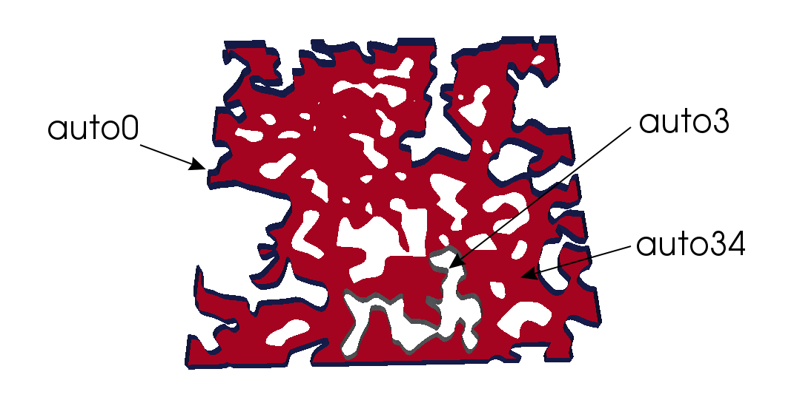
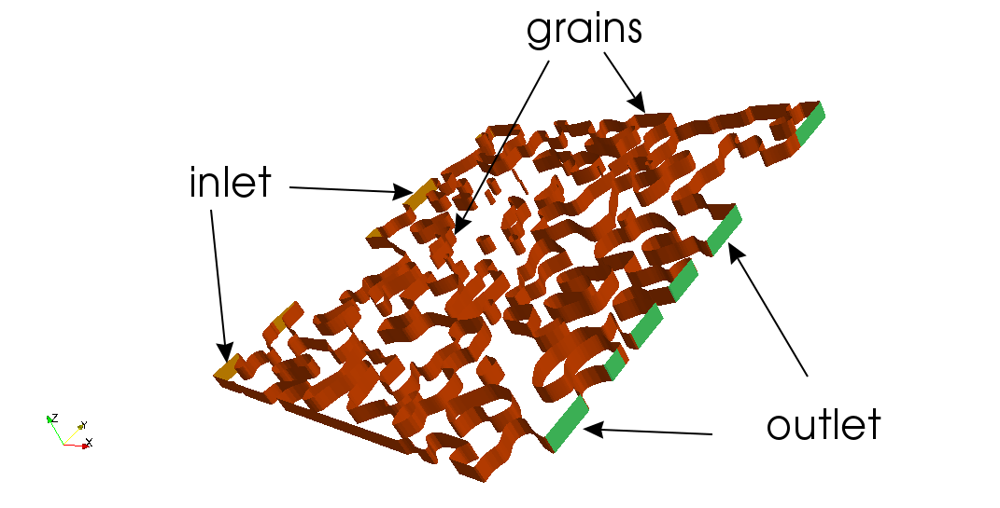

# Assignment for "Meshing tools"

## Goals

- Master `cfMesh` workflow

## Basic-level skills

### Basic `cfMesh` usage

By now you should know that if mesh generation with `cfMesh` is to be attempted,
we need to go through a couple of steps:

- Prepare a geometry file for the external surface of the domain
- Set minimal cell size in `system/meshDict`

In this section, we'll attempt to mesh a pore-scale representation of a porous
sample; similar to what we featured in the lectures.

Of course, you'll go through **all** the steps; starting from preparing the
geometry file up to defining boundary patches on the OpenFOAM mesh. So, let's
get started.

#### Preparing a sample geometry file

Typically, you would usually get the geometry from some CAD software; but we'll
try to generate one in this section.

1. The first step is to install [PoreSpy Library](https://github.com/PMEAL/porespy) 
   in the container; Clone this
   repository and run the `scripts/installPorespy.sh` file (This may take some
   time):

```bash
(rem) > git clone https://github.com/FoamScience/assignment-meshing-tools
(rem) > cd assignment-meshing-tools
(rem) > chmod +x scripts/installPorespy.sh
(rem) > ./scripts/installPorespy.sh
```

> PoreSpy is a collection of image analysis tool used to extract information 
> from 3D images of porous materials; we are interested only in the generation
> of a sample porous material at this point.

2. Then, generating a sample porous material is as simple as running the
   following code in a python interpreter:

```python
(rem) > run; ipython
>>> import porespy as ps
>>> import matplotlib.pyplot as plt
# An artificial 400x400 (40%-)porous medium
>>> im = ps.generators.blobs(shape=[400, 400], porosity=0.4, blobiness=1.5)
>>> plt.imsave('porous-media.png', im)
>>> exit
```

- The first line switches to the `run` directory, and starts a Python session
  there.
- All subsequent lines should be executed in that Python session.
- The first two commands are just "imports", loading some the required modules.
- Then, we use `porespy.generators.blobs` to generate our sample porous medium
  and save the results into an object `im`.
- The `shape` dimensions are "pixels", and the blobiness affects how well the "pores"
  are connected to each other.
- The following command saves the `im` object as a PNG image.
- The last one terminates the Python session, getting us back to the shell.

You can now download the image to your local machine (if you haven't mounted any
remote directories locally, which is the recommended way):
```bash
(rem) > scp -i ~/.ssh/remotesshkey.pem linux1@xxx.xxx.xxx.xxx:/home/linux1/run/porous-media.png /tmp
```
Or, if you are not on \*Nix  locally, you can upload it to `transfer.sh` for
example:
```bash
(rem) > apt install curl -y
(rem) > curl --upload-file ./porous-media.png https://transfer.sh/porous-media.png
```

These operations will result in something similar to:


(Hopefully, you can tell which color represents the grains and which one
represents the flow domain).

3. After generating the PNG image, we need to "trace" it so we know where grain
   boundaries are:
```bash
# First, install some utilities we need
(rem) > apt install netpbm potrace -y
# Then trace the image with potrace
(rem) > pngtopnm porous-media.png > porous-media.pnm
(rem) > potrace -s porous-media.pnm
```

These operations will result in something similar to (the black region
should represent the flow domain):


4. The final step is then to **Extrude** the 2D image into a triangulated 3D geometry.
   This can be automated using some CAD tools (eg. OpenSCAD), but we'll keep
   simple and use [svg2stl.com](http://svg2stl.com) online web service.

   All you have to do is to upload your SVG image, choose an extrusion-height
   (choose the default value, doesn't really matter) and download the generated STL
   file (call it `porous-media.stl`):



#### Surface Quality

Run the `surfaceCheck porous-media.stl` (surfaceCheck is an OpenFOAM utility) and answer the
following questions (based on its output):

5. What's the bounding box of the surface?
6. What's the percentage of the triangles which have a quality of more than 0.75?
7. Are there perfect triangles in your STL file? (Hint: max triangle quality)
8. How many unconnected parts are there?

Note that an example case generated a very low-quality surface for me:

```bash
Triangle quality (equilateral=1, collapsed=0):
    # Quality range:  percentage of triangles
	0 .. 0.05  : 0.29404
	0.05 .. 0.1  : 0.0917934
	0.1 .. 0.15  : 0.0886098
	0.15 .. 0.2  : 0.10612
	0.2 .. 0.25  : 0.107358
	0.25 .. 0.3  : 0.08578
	0.3 .. 0.35  : 0.0678281
	0.35 .. 0.4  : 0.0535904
	0.4 .. 0.45  : 0.0363459
	0.45 .. 0.5  : 0.0254687
	0.5 .. 0.55  : 0.0168023
	0.55 .. 0.6  : 0.0103467
	0.6 .. 0.65  : 0.00504068
	0.65 .. 0.7  : 0.00468695 
	0.7 .. 0.75  : 0.00353732
	0.75 .. 0.8  : 0.0010612
	0.8 .. 0.85 : 0.000707464
	0.85 ..  0.9  : 0.000265299
	0.9 ..  0.95 : 0.000265299
	0.95 ..  1 : 0.000353732

min 1e-15 for triangle 4 
max 0.999555 for triangle 3056
```

A first look on these metrics suggests that the surface file is of
**poor quality**, but this may not always be the case:

9. `surfaceCheck` automatically writes problem faces to a file `badFaces`;
   you can view them if you use `surfaceSubset` (another OpenFOAM utility):
   - Copy the default dictionary file for the utility:
   ```bash
   (rem) > cp $FOAM_APP/utilities/surface/surfaceSubset/surfaceSubsetDict .
   ```
   - Inside that dictionary, you should set the `faces` keyword to read the bad
   faces from the file:
   ```cpp
   faces   #include "badFaces";
   ```
   - You can also comment out the whole `surfaces` sub-dictionary in there.
   - Then run the command:
   ```bash
   (rem) > surfaceSubset surfaceSubsetDict porous-media.stl badFaces.stl
   ```
   - You can view `badFaces.stl` using ParaView.

Depending on the `cfMesh` workflow you intend to use 
(`cartesian2DMesh`, `cartesianMesh`, `tetMesh`, `pMesh` ); 
these faces may not be that important. For example, for `cartesian2DMesh`
meshes, faces whose normals are in the z-direction are ignored. In fact,
we have to remove them for the utility to work.


#### `cartesian2DMesh` workflow

The surface file now is ready for most cfMesh workflow, but the `cartesian2DMesh`
workflow requires the absence of any faces whose normals are going in the
z-direction.

Because we've **extruded** the SVG file in the z-direction, we don't have to
worry about face normals having (non-null) all 3 components. We know that, for
every surface face, at least one normal component is null.

We'll attempt to remove these xy-plane faces next. Here are some methods one can
use (Pick the one you're most comfortable with):

**Method 01:**

STL gemetries are stored as plain-text files, describing triangles in a trivial manner (mentioning
the face normal):
```
facet normal 0 0 -1
   outer loop
     vertex 0 43.801 -2.5
     vertex 0.282 51.506 -2.5
     vertex 0.586 51.524 -2.5
   endloop
endfacet
```
So, a simple text-editor command (or just use: `sed`) could look for the normals 
we want to delete, and delete the whole facet block (which always spans over 7 lines).

For example, using `sed`, you can
```bash
(rem) > sed -e '/facet normal 0 0/,+6d' porous-media.stl > porous-media-2d.stl
```

**Method 02:**

The previous method makes the somewhat-"dangerous" assumption that the pattern
`facet normal 0 0.*` exactly matches every triangle normal we want to delete.

A more accurate method would be chainning a series of ParaView filters to get the
same effect of the previous `sed` command:

- Start by loading `porous-media.stl`, and calculating normals with the help of
  `GenerateSurfaceNormals` filter with the following settings:
  - Feature angle: 0 (but not that important)
  - `Compute Cell Normals` box checked
  - Everything else: Use default values

- On top of the `GenerateSurfaceNormals` filter, apply a `Calculator` filter
  with the following settings (No actual calculations, just making a copy
  of normal z-component and naming it "Z"):
  - Attribute Mode: Point Data
  - Result Array Name: Z
  - From scalas menu, choose `Normals_Z` 

- Now that we have the scalar field Z ready, apply a `Threshold` filter to the
  `Calculator` one, with the following settings (To select only faces that have
  normals with a null z-component):
  - Scalars: Z
  - Minimum: 0
  - Maximum: 0

- Finally, apply an `ExtractSurface` filter, and with the final object selected,
  Go to `File > Save Data` to save the surface as an STL file 
  (name it `porous-media-2d.stl`).


Now run `surfaceCheck` on the new STL file:

10. How the general triangles quality trend compare to the original 3D STL
	geometry?
11. Are there any outstanding-quality triangles?
12. What you should pay attention to now is the minimal and maximal edge
    length in the surface file because we want to choose a cellSize that
	captures most the details in the surface. what are these values?
	Hint: Examine the output of `surfaceCheck`.

Taking into consideration that, for a sample run, the bounding box was
`(0 0 -2.5) (141.139 141.111 2.5)`, min edge length: 0.15 and max edge
length: 60; The meshing process was successful with the following meshDict:

```cpp
FoamFile
{
    version     2.0;
    format      ascii;
    class       dictionary;
    object      meshDict;
}
// * * * * * * * * * * * * * * * * * * * * * * * * * * * * * * * * * * * * * //

surfaceFile   "porous-media-2d.stl";
minCellSize   0.5;
maxCellSize   10;
```

> Of course, you can use our intoductory case as a dummy base for your meshing
> experiments:
> ```bash
> (rem) > git clone https://github.com/FOAM-School/res-eng-openfoam-intro porousMesh
> (rem) > rm -r porousMesh/0 porousMesh/0.orig
> (rem) > cp porous-media-2d.stl porousMesh/
> ```

Whe choosing minimal cell size in such situations, it's probably best to start
with a relatively large one (2.0 for example) and decrease it as you check the
quality of generated meshes (with `checkMesh -constant` if you have deleted 
time directories) until all mesh tests pass.

These `cellSize` configurations resulted in the following stats:
- Cells count around 50,500, 88% of which are hexes, the remaining ones are
  polyhedrons
- Max non-orthogonality: 33 degrees
- Max skewness around 3.0

Of course, `cfMesh` meshed the largest region of the domain as it had some 
unconnected regions (isolated pores).

13. You can estimate the effective porosity (virtually):
- First, calculate the bounding box volume ( Vb )
- Then calculate Vm/Vb where Vm is the mesh volume reported by `checkMesh`
- Compare the result to the 0.4 we specified for the PNG image earlier.



## Intermediate skills

### Boundary Patches

Wait! what about boundary patches??

Currently, all boundary faces are assembled into a single patch, which is
not so useful. If the STL file had some solid names in it they would have
been retained as boundary patches; but that's "rare" in such situations.
Sure enough, OpenFOAM has some nice utilities that can help.

1. The first step is to run `autoPatch`. This utility tries to figure out
   the distinct patches following a provided feature angle:

```bash
(rem) > autoPatch 75 -overwrite
```
The utility will then generate many patches (around 36) where:
- The first patch (`auto0`) is the outer boundary of the domain in the x-y
  plane.
- The last two patches (`auto34` and `auto35`) are the "FrontAndBack" patches
  (patches whose normals are in the z-direction and should have an empty type)
- The remaining patches represent each grain boundaries. 

Load the case into ParaView, you can view each patch checking its box in 
`Mesh Regions` in the Properties panel of the case object.



Next, we need to separate inlet and outlet faces from the `auto0` patch where:
- Outlet faces:
  - are located at the far right of the domain (in respect to X-direction)
  - have a normal vector of (1 0 0) (going out of the domain)
- Inlet faces:
  - are located at the far left of the domain (in respect to X-direction)
  - have a normal vector of (-1 0 0) (going out of the domain)
- We would also like to merge all `auto1..33` patches into a single `grains`
  patch.

All of these operations can be performed with the help of another OpenFOAM
utility called `createPatch`, but we'll need to generate some faceSets first.

> faceSets are exactly what the name suggests: Groups of faces with common
> properties.


2. The `setSet` utility provides an interactive shell and also accepts a batch
   script to create all sorts of sets (You can execute these commands one by 
   one or assemble them into a script):

```bash
# File: extractOutletFaces
# Create a faceSet out of auto0 patch using patchToFace source
# (Converts the patch to a faceSet)
faceSet outletSet new patchToFace auto0
# Delete all faces where x coordinate is less than 141
# (Keeping the far right ones - Based on te bounding box information)
faceSet outletSet delete boxToFace (0 0 -2.5) (141 141.139 2.5)
# Create a set for faces whose normals are not (1 0 0) (tolerance = 1e-3)
faceSet f0 new normalToFace (1 0 0) 1e-3
faceSet f0 invert f0
# Remove these faces from the outlet set
faceSet outletSet delete faceToFace f0
```
To execute the script, you can run:
```bash
(rem) > setSet -batch extractOutletFaces
```

> It's good to check that the faceSet is not **empty** at this point!

Perform similar operations to get the corresponding `inletSet`.

3. You can also create `frontAndBackSet` by combining the last two patches
   , for example (This is a `setSet` command, not a shell one):

```bash
faceSet frontAndBackSet new patchToFace "(auto34|auto35)"
```
4. The remaining faces should be collected into a `grainsSet` (These are
   `setSet` commands)

```bash
# Collect all boundary faces into grainsSet
faceSet grainsSet new patchToFace "(auto.*)"
# Remove faces from other faceSets
faceSet grainsSet delete faceToFace inletSet
faceSet grainsSet delete faceToFace outletSet
faceSet grainsSet delete faceToFace frontAndBackSet
```

5. Now that all needed face sets are ready, we'll use OpenFOAM's `createPatch`
   utility to convert face sets to boundary patches. Of course, the utility is
   driven by a dictionary file located in the `system` directory

```bash
(rem) > cp $FOAM_APP/utilities/mesh/manipulation/createPatch/createPatchDict system
```
We only need to overwrite the `patchInfo` keyword with (You should attempt to
figure it out by yourself first):

```bash
patchInfo
(
	{
		name inlet;
		dictionary 
		{ 
			type patch; 
			neighbourPatch auto0; 
		}
		constructFrom set;
		set inletSet;
	}
	{
		name outlet;
		.... Complete it yourself
	}
	{
		name frontAndBack;
		.... Complete it yourself
	}
	{
		name grains;
		.... Complete it yourself
	}
);
```

When choosing boundary patch types, refer to OpenFOAM user guide for help;
In this case, the following patch types are sufficient:

| Patch Type | Description                                             |
|------------|---------------------------------------------------------|
| patch      | A generic patch type, suitable for inlet/outlet patches |
| wall       | A patch where fluid velocity is expected to be null     |
| empty      | Ignores the flow in the normal direction to the patch for (font and back patches) |

Finally, we can run the tool:
```bash
(rem) > createPatch -overwrite
```

- `auto.*` patches are automatically deleted
- Run `checkMesh -constant` and see if boundary-mesh problems arise.
- Check `constant/polyMesh/boundary` file

The result should look like this:



> One last note: All of these "face sets" are stored in plain-text files under
> `constant/polyMesh/sets` like everything else.

> It's also recommended to backup your generated mesh at this stage:
> ```bash
> (rem:run/porousMesh) > tar cvf mesh.tar .
> ```

## Advanced skills

### cfMesh workflow control

Add the following lines to `system/meshDict` then run `foamCleanTutorials && cartesian2DMesh`

```cpp
workflowControls {
	stopAfter templateGeneration;
	restartFromLatestStep 0;
}
```
1. How many regions the mesh has at this point? (Hint: use `checkMesh -constant` as usual).
2. Replace `templateGeneration` with `surfaceProjection` and run the command again.
   Does the generated mesh pass all checks?
3. `cfMesh` has 8 workflow controls; try each one separately to get a feel for
   what's happening thoughout the meshing process (Hint: Refer to cfMesh user
   guide).
